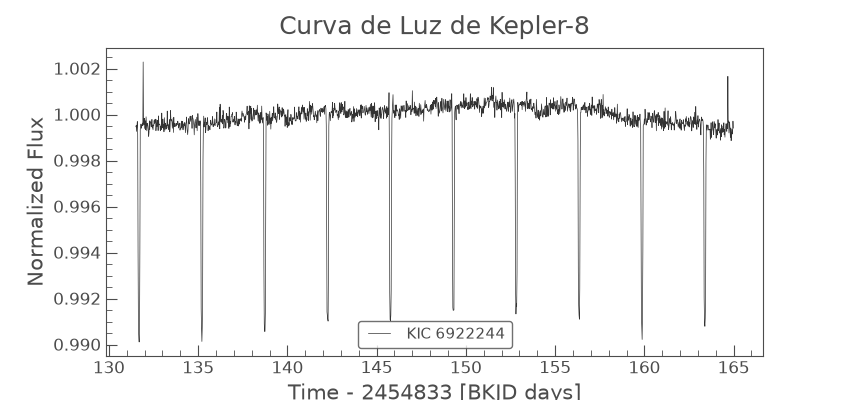
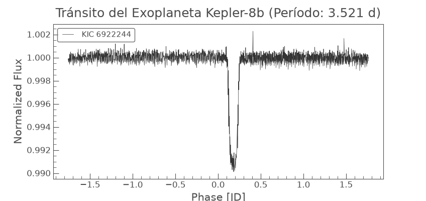
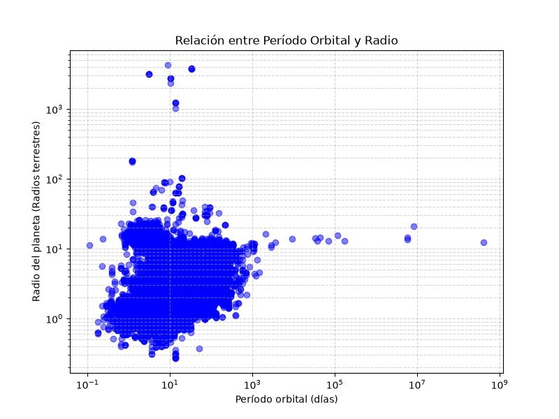

# Análisis de Kepler-8b y Población de Exoplanetas 🪐

Este proyecto realiza un estudio observacional y estadístico sobre exoplanetas. Se divide en dos fases: la detección directa del tránsito del exoplaneta **Kepler-8b** mediante el procesamiento de curvas de luz de la misión Kepler, y un análisis demográfico de la población general de exoplanetas confirmados.

## Descripción del Proyecto

El código implementa técnicas de análisis de datos astrofísicos para:
1. **Caracterización de Kepler-8b:** Descarga de observaciones del Quarter 1 de la misión Kepler. Se realiza la limpieza de la señal (eliminación de valores nulos y normalización del flujo) y se aplica el algoritmo BLS (Box Least Squares) para aislar el patrón periódico y determinar el período orbital exacto.
2. **Contexto Demográfico:** Conexión mediante TAP con el NASA Exoplanet Archive (Caltech/IPAC) para extraer datos de todos los exoplanetas conocidos y evaluar la relación geométrica entre sus períodos orbitales y sus radios.

## Resultados Visuales

### 1. Curva de Luz Original (Kepler-8)
Serie temporal del flujo lumínico normalizado de la estrella Kepler-8, donde se aprecian las caídas de luz generadas por el planeta.


### 2. Tránsito Plegado (Kepler-8b)
Curva de luz doblada sobre el período orbital calculado (3.521 días), revelando con alta precisión el perfil del tránsito planetario.


### 3. Distribución Demográfica
Gráfica logarítmica que compara el período orbital y el radio planetario de los exoplanetas confirmados en la base de datos de la NASA.


## Estructura del Repositorio

- `src/detector_exoplanetas.py`: Script para el análisis de fotometría, cálculo del periodograma BLS y pliegue de la curva de luz.
- `src/main.py`: Script para la extracción masiva de datos (TAP sync) y generación del diagrama de dispersión de la población exoplanetaria.
- `plots/`: Directorio que almacena las gráficas resultantes del análisis.

## Requisitos e Instalación

```bash
git clone [https://github.com/tu_usuario/tu_repositorio.git](https://github.com/tu_usuario/tu_repositorio.git)
cd EXOPLANETAS_PY
pip install lightkurve matplotlib numpy pandas

## Competencias Técnicas Aplicadas

* **Procesamiento de Señales (DSP):** Limpieza de ruido en series temporales, normalización de flujos y aplicación del algoritmo Box Least Squares (BLS) para aislar frecuencias en telemetría.
* **Extracción de Telemetría Real:** Conexión y consulta estructurada a los archivos oficiales de misiones espaciales (NASA Exoplanet Archive).
* **Análisis y Visualización de Datos:** Procesamiento de matrices, filtrado de valores atípicos y representación de bases de datos astronómicas poblacionales.